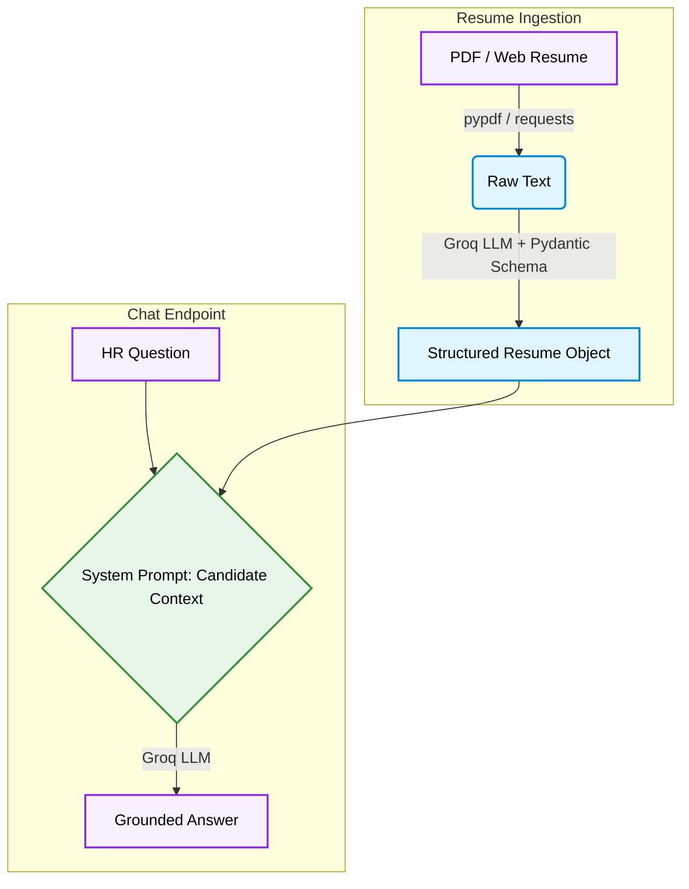

<div align="center">

# Hire-Me-AI - AI-Powered Resume Parser & Chatbot

Developed as part of a project-based AI engineering curriculum, this is extended from a resume-parsing exercise into a production FastAPI backend that parses a PDF resume into structured data and lets HR
chat with an AI that represents the candidate - grounded only in what the
resume actually says.

```
HR: "What frameworks has this candidate worked with?"
AI: "Based on the resume, the candidate has worked with FastAPI, Streamlit,
     and Flask across their internship and project experience."
```

No hallucination. No generic answers. Every response is anchored to the
parsed resume.

[](https://www.python.org/)
[](https://fastapi.tiangolo.com/)
[](https://groq.com/)
[](https://docs.pydantic.dev/)

</div>

---

## Stack

| Layer             | Choice                        |
| ----------------- | ----------------------------- |
| API               | `FastAPI` + `Uvicorn`         |
| LLM               | `Groq` - `openai/gpt-oss-20b` |
| Schema Validation | `Pydantic`                    |
| PDF Parsing       | `pypdf`                       |

---

## How It Works



## Features

|                            |                                                                                            |
| -------------------------- | ------------------------------------------------------------------------------------------ |
| **PDF + URL Support**      | Extracts raw text from local PDFs or public URLs                                           |
| **Schema-Driven Parsing**  | Resume is parsed into a fixed Pydantic schema regardless of section headings or formatting |
| **Candidate AI**           | The LLM answers as the candidate - professional, fact-bound, no invention                  |
| **Live Portfolio Context** | Downloads and caches context directly from the live portfolio website                      |
| **Groq-Powered**           | Fast structured-JSON inference via `openai/gpt-oss-20b`                                    |

---

## Tech Stack

| Component             | Technology                  |
| --------------------- | --------------------------- |
| API Framework         | FastAPI                     |
| LLM                   | Groq - `openai/gpt-oss-20b` |
| Schema Validation     | Pydantic                    |
| PDF Parsing           | pypdf                       |
| Dependency Management | uv                          |

---

## Project Structure

```
Hire-Me-AI/
├── backend/
│   ├── main.py          # FastAPI app - resume parsing + /chat endpoint
│   └── my_resume.pdf    # Drop your resume here
├── main.py              # Entry point
├── pyproject.toml
└── README.md
```

---

## Setup and Installation

### Prerequisites

- Python 3.11+
- A [Groq API key](https://console.groq.com/keys)
- [`uv`](https://docs.astral.sh/uv/) installed

### 1. Clone the repository

```bash
git clone https://github.com/Shashank17singh/Hire-Me-AI.git
cd Hire-Me-AI
```

### 2. Install dependencies

```bash
uv sync
```

### 3. Set your Groq API key

```bash
cp .env.example .env
# then edit .env and add: GROQ_API_KEY=your_api_key_here
```

### 4. Add your resume

Drop your PDF resume into `backend/` or rely on the environment variables (`RESUME_URL`, `RESUME_GDRIVE_ID`).

### 5. Start the server

```bash
cd backend
uv run uvicorn main:app --reload
```

---

## API Reference

### `GET /`

Serves the interactive chat UI.

### `POST /chat`

Ask a question about the candidate.

**Request body**

```json
{ "question": "What is this candidate's strongest technical skill?" }
```

**Response**

```json
{
  "answer": "Based on the resume, the candidate's strongest technical skill is..."
}
```

---

## Known Limitations

- The server currently caches the parsed resume globally in memory. If you want to support multiple candidates simultaneously, you'll need session-based caching.
- Scanned / image-only PDFs with no extractable text will return empty parses; use a text-based PDF.
